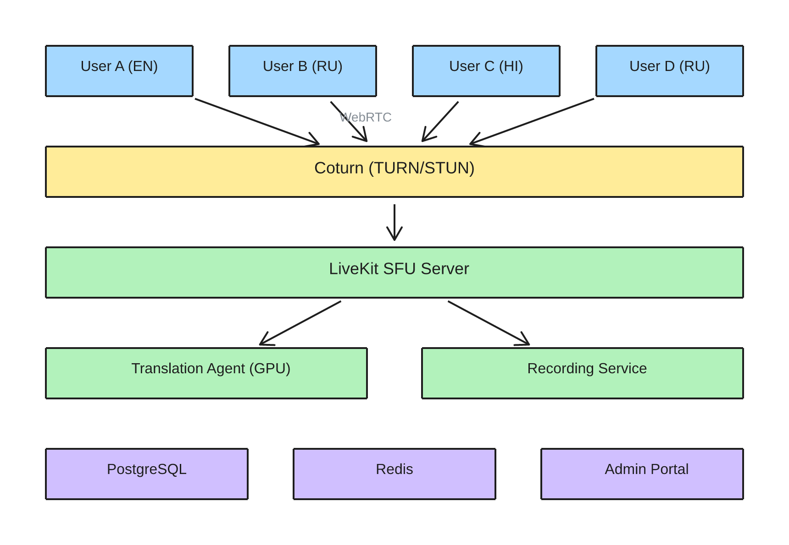
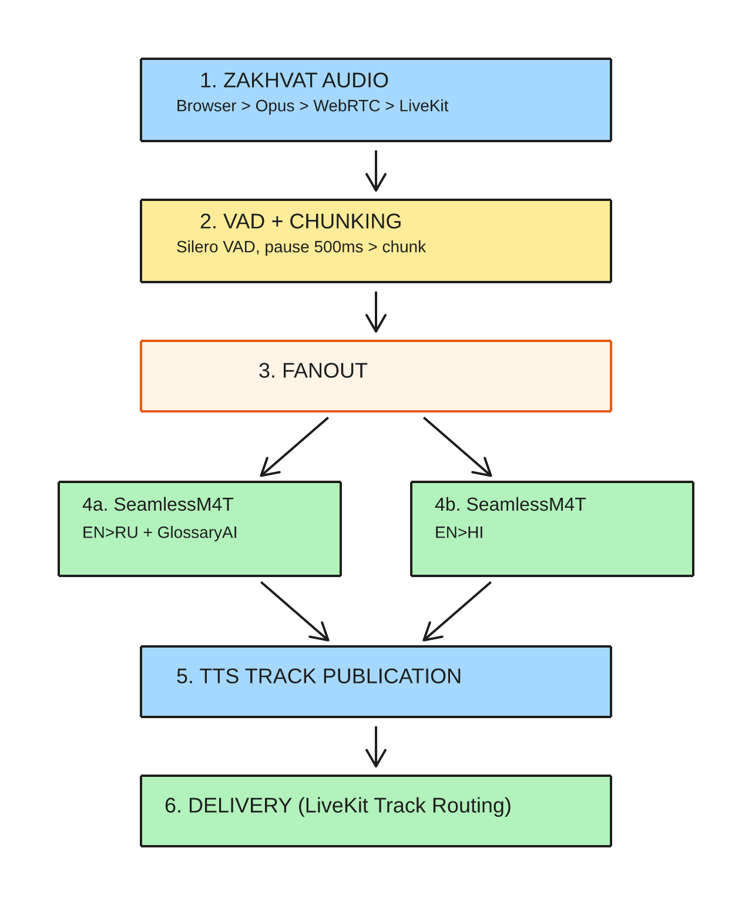
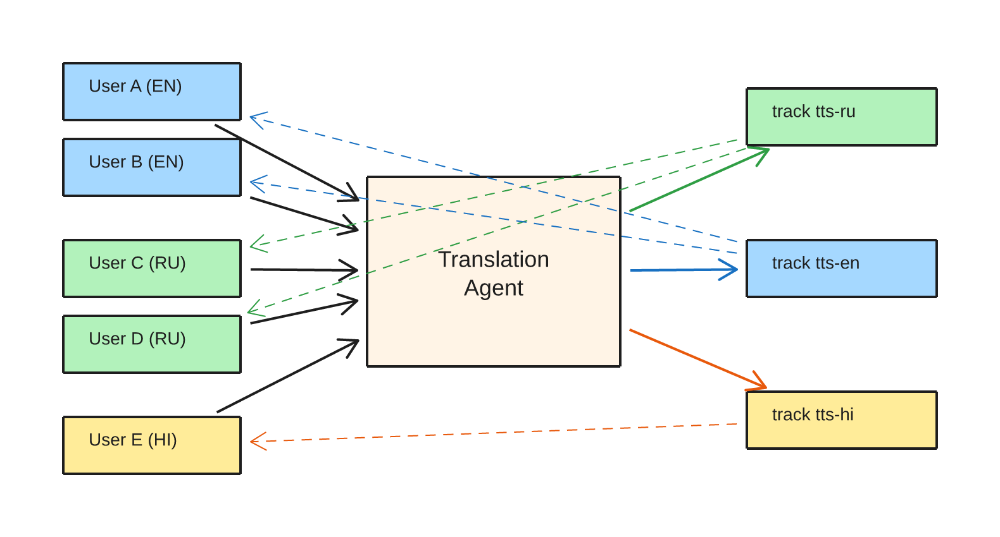
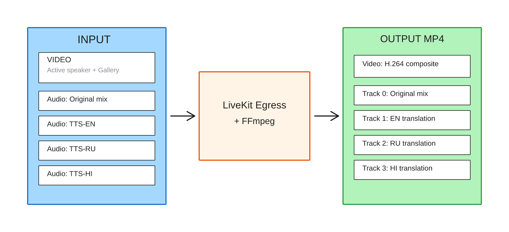
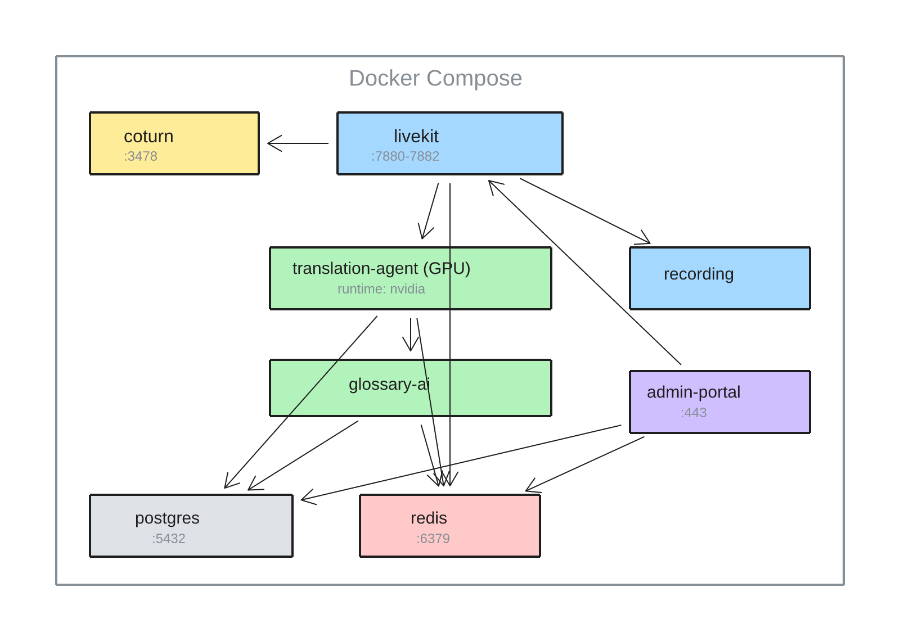

# 5. Архитектура системы

> Раздел технического задания SyncVoice™ v0.2

---

## 5.1 Обзор архитектуры

### Общая схема компонентов



### Принцип работы (краткое описание)

1. **Участник** открывает ссылку в браузере, выбирает язык и подключается к конференции через WebRTC.
2. **LiveKit SFU** принимает аудио и видео от каждого участника и раздаёт видео всем остальным.
3. **Translation Agent** получает аудио каждого говорящего, определяет момент окончания фразы (VAD) и отправляет фрагмент на перевод.
4. **SeamlessM4T v2** на GPU переводит речь на каждый целевой язык и генерирует синтезированное аудио; GlossaryAI применяет терминологию.
5. **Переведённое аудио** публикуется обратно в LiveKit как отдельный трек для каждого языка — участники слышат только перевод на свой язык.
6. **Recording Service** параллельно записывает видео и все языковые аудиодорожки в единый MP4-файл.
7. **Admin Portal** позволяет управлять конференциями, пользователями, глоссариями и просматривать записи.

---

## 5.2 Компоненты системы

### 5.2.1 WebRTC SFU — LiveKit Server

| Параметр | Значение |
|----------|----------|
| **Назначение** | Приём и маршрутизация аудио/видео потоков между участниками и агентами |
| **Технология** | LiveKit (Go), self-hosted |
| **Лицензия** | Apache 2.0 |

**Почему LiveKit:**
- Первоклассный Python SDK (LiveKit Agents) — подписка на audio tracks, обработка и публикация обратно без GStreamer/FFmpeg
- Модель Rooms + Tracks — один published track раздаётся множеству подписчиков без дублирования
- Встроенная поддержка TURN/STUN, Data Channels для метаданных
- On-premise деплой — один Docker-контейнер

### 5.2.2 Translation Agent

| Параметр | Значение |
|----------|----------|
| **Назначение** | VAD-детекция, chunking речи, оркестрация translation pipeline |
| **Технология** | Python 3.11+ / asyncio / LiveKit Agents SDK |
| **VAD** | Silero VAD (ONNX, ~2MB, ~30ms latency per frame) |

**Функции:**
- Подписка на audio track каждого участника через LiveKit Agents SDK
- VAD: определение начала/конца фразы (Silero VAD, порог 0.5, пауза ≥500ms)
- Adaptive chunking: разделение речи на фрагменты 1–4 секунды
- Принудительный split при непрерывной речи >5 секунд (с overlap 300ms для контекста)
- Fanout: для каждого фрагмента — запуск перевода на все целевые языки параллельно
- Публикация TTS-аудио как именованных треков в LiveKit

### 5.2.3 Translation Model — SeamlessM4T v2

| Параметр | Значение |
|----------|----------|
| **Назначение** | End-to-end перевод речи: ASR + NMT + TTS в одной модели |
| **Технология** | SeamlessM4T v2 Large (Meta, PyTorch) |
| **Лицензия** | CC BY-NC 4.0 (коммерческая лицензия обсуждается отдельно) |
| **Языки** | EN, RU, HI (100+ поддерживаемых) |
| **RTF** | ~0.5–0.8 на A100 (batch mode) |

**Почему SeamlessM4T v2:**
- Единственная open-source E2E модель с поддержкой S2ST (speech-to-speech translation) для EN/RU/HI
- Одна модель заменяет каскад ASR → NMT → TTS: меньше точек отказа, проще деплой
- RTF <1.0 на A100 — реальное время достижимо
- Расширяемость: добавление языков без изменения архитектуры

**Fallback-стратегия:** SeamlessStreaming (S2TT) + внешний TTS для сценариев с жёсткими требованиями к latency (~2–2.7s vs ~2–3s batch).

### 5.2.4 GlossaryAI

| Параметр | Значение |
|----------|----------|
| **Назначение** | Применение доменной терминологии к результату перевода |
| **Технология** | Python-модуль, post-processing |

**Механизм работы:**
1. После ASR-этапа (или из промежуточного текста SeamlessM4T) извлекается текстовое представление перевода
2. GlossaryAI выполняет поиск по словарю терминов (trie / hash-lookup, <1ms)
3. Замена терминов по правилам: точное совпадение, «не переводить», фонетическая транскрипция
4. Скорректированный текст подаётся на TTS-этап (если каскадный режим) или применяется как constrained output

**Поддержка:** 2000+ терминов, импорт из CSV/Excel, версионирование с откатом.

### 5.2.5 Recording Service

| Параметр | Значение |
|----------|----------|
| **Назначение** | Запись конференции: видео + многодорожечное аудио по языкам |
| **Технология** | LiveKit Egress API + FFmpeg |

Подробная архитектура записи — см. раздел 5.5.

### 5.2.6 Admin Portal

| Параметр | Значение |
|----------|----------|
| **Назначение** | Веб-интерфейс управления системой |
| **Технология** | React 18+ / TypeScript / REST API |

**Функции:** дашборд реального времени (активные конференции, GPU, latency), управление пользователями и ролями, CRUD глоссариев, история сессий, архив записей, white-label настройки.

### 5.2.7 PostgreSQL

| Параметр | Значение |
|----------|----------|
| **Назначение** | Персистентное хранение: пользователи, сессии, глоссарии, метаданные записей |
| **Технология** | PostgreSQL 16 |
| **Лицензия** | PostgreSQL License (пермиссивная) |

### 5.2.8 Redis

| Параметр | Значение |
|----------|----------|
| **Назначение** | Очереди translation pipeline, состояние агентов, кэш метаданных сессий |
| **Технология** | Redis 7+ (Streams для очередей) |
| **Лицензия** | BSD-3 (Redis 7.0) / RSALv2 (Redis 7.4+) |

### 5.2.9 TURN/STUN Server — Coturn

| Параметр | Значение |
|----------|----------|
| **Назначение** | NAT traversal для WebRTC-соединений внутри корпоративной сети |
| **Технология** | Coturn |
| **Лицензия** | BSD-3 |

Coturn обеспечивает подключение участников из различных подсетей без прямого P2P-доступа. Критичен для on-premise инсталляций с сегментированной сетью.

---

## 5.3 Поток данных (Data Flow)

### Один цикл перевода — детальная схема



**ИТОГО end-to-end latency (p95): ≤2 секунды** = ~100ms (сеть) + ~500-1500ms (VAD/chunk) + ~500-800ms (модель, A100) + ~100ms (сеть)

### Место GlossaryAI в pipeline

GlossaryAI работает на этапе 4 — между NMT и TTS:

**Audio → ASR → текст (source) → NMT → текст (target) → GlossaryAI → TTS → audio**

GlossaryAI выполняет: поиск по словарю, замену терминов, правила «не переводить», фонетические транскрипции.

В режиме end-to-end (SeamlessM4T S2ST) GlossaryAI применяется как post-processing к промежуточному текстовому представлению с повторной генерацией TTS для изменённых сегментов.

---

## 5.4 Маршрутизация потоков по языкам

### Схема N участников × M языков

Для конференции с 10 участниками и 3 языками (EN=3, RU=4, HI=3):



### Оптимизация: один перевод на языковую пару

Ключевой принцип — **перевод выполняется один раз для пары (говорящий, целевой язык)**. Результат публикуется как один LiveKit audio track, на который подписываются все участники с данным языком.

**Пример:** Говорящий A1 (EN) произнёс фразу → translate(EN→RU) = 1 вызов модели → track "tts-ru-from-A1" (подписаны: B1–B4) → translate(EN→HI) = 1 вызов → track "tts-hi-from-A1" (подписаны: C1–C3). **Итого: 2 вызова модели вместо 7.**

### Количество translation jobs

| Метрика | Формула | Пример (10 уч., 3 языка) |
|---------|---------|--------------------------|
| Переводов на одного говорящего | M − 1 (число целевых языков) | 2 |
| Max concurrent (все говорят) | N × (M − 1) | 20 |
| Реалистичный concurrent | 1–2 говорящих × (M − 1) | 2–4 |

### Схема подписок (кто какой track получает)

| Участник | Язык | Подписан на tracks | НЕ подписан |
|----------|------|--------------------|-------------|
| A1 (EN) | EN | tts-en-from-B*, tts-en-from-C* | tts-en-from-A1 (свой), tts-ru-*, tts-hi-* |
| B1 (RU) | RU | tts-ru-from-A*, tts-ru-from-C* | tts-ru-from-B* (свои), tts-en-*, tts-hi-* |
| C1 (HI) | HI | tts-hi-from-A*, tts-hi-from-B* | tts-hi-from-C* (свои), tts-en-*, tts-ru-* |

Управление подписками реализовано на стороне LiveKit через Server SDK: при подключении участника агент устанавливает track subscription rules на основе выбранного языка.

---

## 5.5 Архитектура записи

### Структура записи конференции



### Детали реализации

- **Video compositing**: LiveKit Egress поддерживает composite layout (active speaker + grid). Настраивается через Egress API при старте записи.
- **Audio tracks**: каждый языковой TTS-track миксуется в отдельную аудиодорожку. FFmpeg объединяет video + N audio в мультидорожечный MP4.
- **Хранение**: локальная файловая система сервера. Политика retention настраивается в Admin Portal.
- **При воспроизведении**: пользователь выбирает языковую дорожку в плеере (VLC, браузерный плеер с выбором track).

---

## 5.6 Деплой

### Docker Compose — схема контейнеров

```yaml
# docker-compose.yml (схема)
services:
  livekit:          # LiveKit SFU Server
    image: livekit/livekit-server
    ports: [7880, 7881, 7882]  # HTTP, RTC (TCP/UDP)
    depends_on: [redis]

  translation-agent: # Translation Agent (Python)
    build: ./agent
    runtime: nvidia   # GPU доступ
    deploy:
      resources:
        reservations:
          devices:
            - capabilities: [gpu]
    depends_on: [livekit, redis, postgres]

  glossary-ai:       # GlossaryAI Service
    build: ./glossary
    depends_on: [postgres, redis]

  recording:         # Recording Service
    build: ./recording
    volumes: [recordings:/data/recordings]
    depends_on: [livekit]

  admin-portal:      # Admin Portal (React + API)
    build: ./admin
    ports: [443]
    depends_on: [postgres, redis, livekit]

  postgres:          # PostgreSQL
    image: postgres:16
    volumes: [pgdata:/var/lib/postgresql/data]

  redis:             # Redis
    image: redis:7-alpine

  coturn:            # TURN/STUN Server
    image: coturn/coturn
    ports: [3478, 5349]  # STUN/TURN
    network_mode: host
```



### Варианты аппаратного обеспечения

Система поддерживает три конфигурации on-prem развёртывания. Клиент выбирает исходя из бюджета, доступности и требований к числу участников.

#### Сравнение конфигураций

| Параметр | NVIDIA A100/A10 | NVIDIA RTX 4090/5090 | Apple Mac Studio | NVIDIA DGX Spark |
|----------|----------------|---------------------|-----------------|-----------------|
| **GPU** | A10/A100 (CUDA) | RTX 4090/5090 (CUDA) | M2/M3/M4 Ultra (MPS) | GB10 Blackwell (CUDA) |
| **Память** | 64–128 GB + VRAM | 32–128 GB + VRAM | 96–192 GB unified | 128 GB unified |
| **ML backend** | PyTorch CUDA | PyTorch CUDA | PyTorch MPS | PyTorch CUDA |
| **Деплой** | Full Docker | Full Docker | Гибридный | Full Docker |
| **OS** | Ubuntu 22.04 | Ubuntu 22.04 | macOS 14+ | Ubuntu (DGX OS) |
| **Форм-фактор** | Tower / Rack | Tower / Rack | Компактный | Компактный |
| **Цена (РФ)** | 1.5M – 5M ₽ | 500K – 2.2M ₽ | 400K – 900K ₽ | ~400K ₽ |
| **Max участников (≤2s)** | 8–15 | 6–12 | 5–8 | 10–15 |
| **Max участников (≤3s)** | 15–25 | 10–20 | 8–12 | 15–20 |
| **Доступность в РФ** | ⚠️ Серый рынок | ✅ Доступны | ✅ Доступны | ⚠️ Серый рынок |
| **Сложность настройки** | Средняя | Низкая | Высокая | Низкая |
| **Основание оценки** | Экстраполяция | ✅ RTX 4090 протестирован | Экстраполяция | Экстраполяция |

---

#### Конфигурация 1: NVIDIA-сервер (для крупных инсталляций)

> ⚠️ Датацентровые GPU NVIDIA (A10, A100) находятся под экспортными ограничениями и доступны в РФ только через серый рынок. Цены ориентировочные и могут существенно варьироваться.

| Параметр | Минимум | Рекомендуемое |
|----------|---------|---------------|
| **GPU** | 1× NVIDIA A10 (24 GB VRAM) | 2× NVIDIA A100 (40/80 GB VRAM) |
| **CPU** | 8 cores (x86_64) | 16+ cores |
| **RAM** | 32 GB | 64 GB |
| **SSD** | 256 GB | 1 TB (для записей) |
| **Сеть** | 1 Gbps | 10 Gbps |
| **CUDA** | 12.0+ | 12.0+ |
| **OS** | Ubuntu 22.04 LTS | Ubuntu 22.04 LTS |
| **Docker** | 24.0+ с NVIDIA Container Toolkit | |

| GPU конфигурация | Max (≤2s) | Max (≤3s) | Цена сервера (РФ) | Примечание |
|-----------------|:---------:|:---------:|:-----------------:|------------|
| 1× A10 (24 GB) | 5–6 | 8–10 | 1 000 000 – 2 000 000 ₽ | ~схожа с RTX 4090 по VRAM |
| 1× A100 (40 GB) | 8–12 | 15–18 | 1 500 000 – 3 000 000 ₽ | ~2× быстрее RTX 4090 |
| 2× A100 (40 GB) | 15–20 | 25–30 | 3 000 000 – 5 000 000 ₽ | Параллелизм по GPU |
| 2× A100 (80 GB) | 20–25 | 30–40 | 4 000 000 – 6 000 000 ₽ | 4+ языка, максимум |

---

#### Конфигурация 2: NVIDIA-сервер с RTX (оптимальная цена/производительность для РФ)

> Consumer/prosumer GPU — не под теми же экспортными ограничениями что датацентровые A100/A10. Наилучшее соотношение цена/производительность для большинства инсталляций в РФ.

| Параметр | RTX 4090 | RTX 5090 |
|----------|----------|----------|
| **VRAM** | 24 GB GDDR6X | 32 GB GDDR7 |
| **Архитектура** | Ada Lovelace | Blackwell |
| **FP16 производительность** | ~82 TFLOPS | ~220 TFLOPS |
| **RTF на SeamlessM4T v2 Large** | ~0.7–1.0 | ~0.4–0.6 |
| **ML backend** | PyTorch CUDA | PyTorch CUDA |
| **OS** | Ubuntu 22.04 LTS | Ubuntu 22.04 LTS |
| **Docker** | Full Docker + NVIDIA Container Toolkit | Full Docker + NVIDIA Container Toolkit |
| **Цена карты (РФ)** | ~300 000 – 400 000 ₽ | ~500 000 – 700 000 ₽ |
| **Цена сервера (РФ)** | ~500 000 – 700 000 ₽ | ~800 000 – 1 200 000 ₽ |

**Особенности:**
- SeamlessM4T v2 Large (~10–15 GB в FP16) комфортно помещается в 24 GB и тем более в 32 GB
- RTX 4090: минимальный запас VRAM при 3 языках и batch inference; рекомендуется 1 карта на 5–8 участников
- RTX 5090: 32 GB + Blackwell arch значительно ускоряет инференс; сопоставим с A100 40 GB по производительности
- Consumer-драйверы работают корректно для инференса (не обучение)
- Возможна установка 2 карт в один сервер для удвоения throughput

| Конфигурация | Max (≤2s) | Max (≤3s) | Цена сервера (РФ) | Примечание |
|-------------|:---------:|:---------:|:-----------------:|------------|
| 1× RTX 4090 (24 GB) | **6** | **10** | 500 000 – 700 000 ₽ | ✅ Протестировано (раздел 7) |
| 2× RTX 4090 (24 GB) | ~12 | ~18 | 900 000 – 1 300 000 ₽ | Параллелизм по GPU |
| 1× RTX 5090 (32 GB) | ~10 | ~15 | 800 000 – 1 200 000 ₽ | ~1.5× быстрее 4090 |
| 2× RTX 5090 (32 GB) | ~18 | ~25 | 1 500 000 – 2 200 000 ₽ | Наилучший баланс для РФ |

---

#### Конфигурация 3: Apple Mac Studio (рекомендуемая для РФ-рынка)

| Параметр | Значение |
|----------|----------|
| **Модель** | Mac Studio с чипом M2 Ultra / M3 Ultra / M4 Ultra |
| **Память** | 96–192 GB unified memory |
| **ML backend** | PyTorch MPS (Metal Performance Shaders) |
| **OS** | macOS 14 Sonoma и выше |
| **Docker** | Docker Desktop (сервисы: LiveKit, PostgreSQL, Redis, Admin Portal) |
| **ML-агент** | Нативный Python (venv), не в Docker — прямой доступ к Metal GPU |

**Особенности деплоя на Mac:**
- Translation Agent запускается как нативный macOS-сервис (launchd), не в Docker
- Все остальные компоненты — в Docker Desktop
- PyTorch с MPS backend: `torch.device("mps")` вместо `cuda`
- Производительность: M3 Ultra показывает ~0.7–1.0 RTF на SeamlessM4T v2 Large

| Конфигурация | Max (≤2s) | Max (≤3s) | Цена (РФ) | Примечание |
|-------------|:---------:|:---------:|:---------:|------------|
| M2 Ultra (192 GB) | ~5 | ~8 | 400 000 – 600 000 ₽ | MPS ~0.8× от RTX 4090 |
| M3/M4 Ultra (192 GB) | ~7 | ~10 | 600 000 – 900 000 ₽ | MPS улучшен в M3/M4 |

---

#### Конфигурация 4: NVIDIA DGX Spark (компактный AI-кирпич)

| Параметр | Значение |
|----------|----------|
| **Чип** | NVIDIA GB10 Grace Blackwell Superchip |
| **GPU** | Blackwell GPU (1 PFLOP FP4) |
| **Память** | 128 GB unified (CPU + GPU через NVLink-C2C) |
| **ML backend** | PyTorch CUDA (Blackwell arch) |
| **OS** | Ubuntu (DGX OS) |
| **Docker** | Full Docker + NVIDIA Container Toolkit |
| **Цена** | ~400 000 ₽ (серый рынок, РФ) |
| **Форм-фактор** | Компактный (размер Mac mini) |

**Преимущества:**
- Стандартный CUDA-стек — идентичная конфигурация с NVIDIA-сервером, только компактнее
- 128 GB unified memory покрывает SeamlessM4T v2 Large с запасом
- Два DGX Spark можно объединить через NVLink для 256 GB и удвоения производительности
- Минимальная сложность настройки — всё в Docker

| Конфигурация | Max (≤2s) | Max (≤3s) | Примечание |
|-------------|:---------:|:---------:|------------|
| 1× DGX Spark | ~10 | ~15 | GB10 Blackwell, ~2× RTX 4090 |
| 2× DGX Spark (NVLink) | ~18 | ~25 | 256 GB unified, 3–4 языка |

> **Расчёт (общий):** при RTF ~0.6 и среднем чанке 2s один GPU-job занимает ~1.2s. При реалистичном сценарии 1–2 одновременно говорящих достаточно одной карты для 10 участников с 3 языками.

---

## 5.7 Стек технологий

| Компонент | Технология | Версия | Лицензия |
|-----------|-----------|--------|----------|
| WebRTC SFU | LiveKit Server | 1.x | Apache 2.0 |
| Translation Agent | Python + LiveKit Agents SDK | 3.11+ / 0.x | Apache 2.0 |
| VAD | Silero VAD | 5.x | MIT |
| Translation Model | SeamlessM4T v2 Large | — | CC BY-NC 4.0 ¹ |
| GlossaryAI | Python (custom) | — | Proprietary |
| Recording | LiveKit Egress + FFmpeg | — | Apache 2.0 / LGPL 2.1 |
| Admin Portal | React 18 + TypeScript | 18.x | MIT |
| API Backend | Python (FastAPI) | 0.11x | MIT |
| База данных | PostgreSQL | 16 | PostgreSQL License |
| Кэш/очереди | Redis | 7.x | BSD-3 ² |
| TURN/STUN | Coturn | 4.x | BSD-3 |
| Контейнеризация | Docker + Docker Compose | 24.x | Apache 2.0 |
| GPU Runtime | NVIDIA CUDA + Container Toolkit | 12.x | Proprietary (NVIDIA) |
| Web Client | React + LiveKit Client SDK | — | Apache 2.0 |
| Audio Codec | Opus (через LiveKit) | — | BSD-3 |

> ¹ CC BY-NC 4.0 — для коммерческого использования требуется отдельное лицензионное соглашение с Meta.
> ² Redis 7.4+ использует RSALv2 + SSPLv1. Для on-premise без redistribution — допустимо.

---

_Раздел является частью ТЗ SyncVoice™ v0.2_
